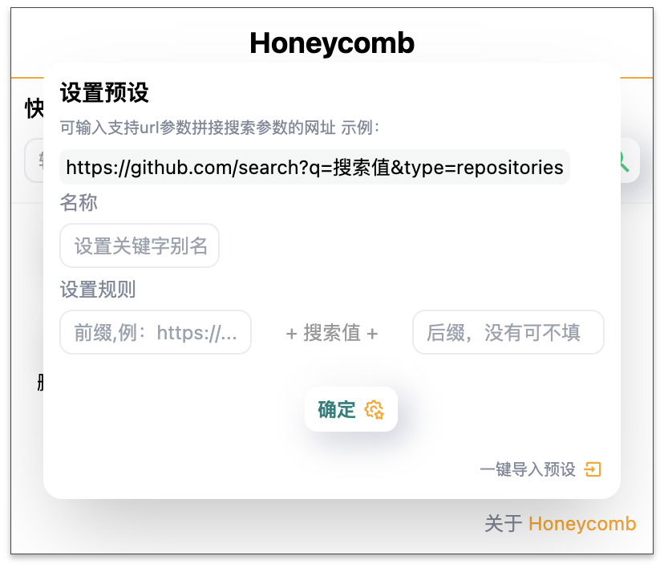
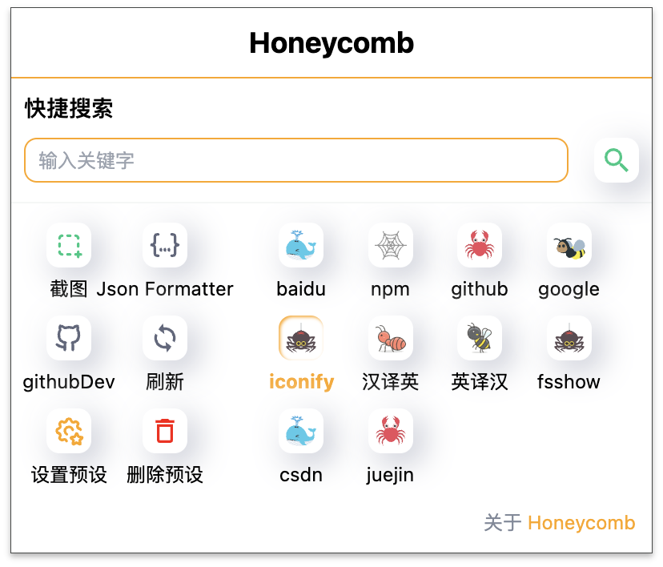
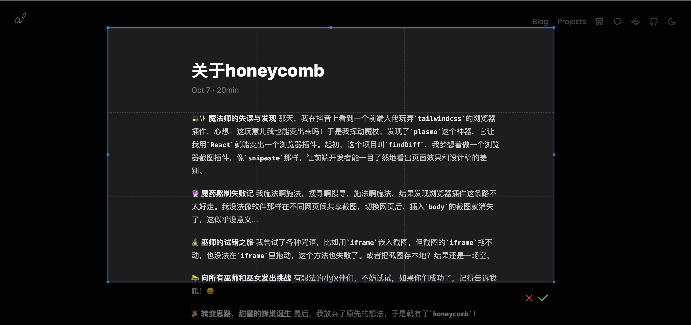
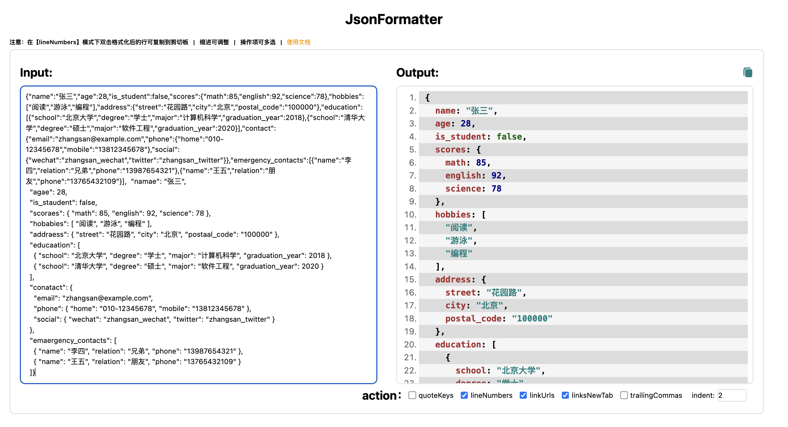
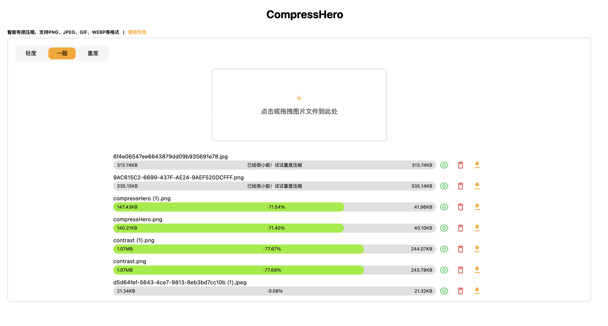
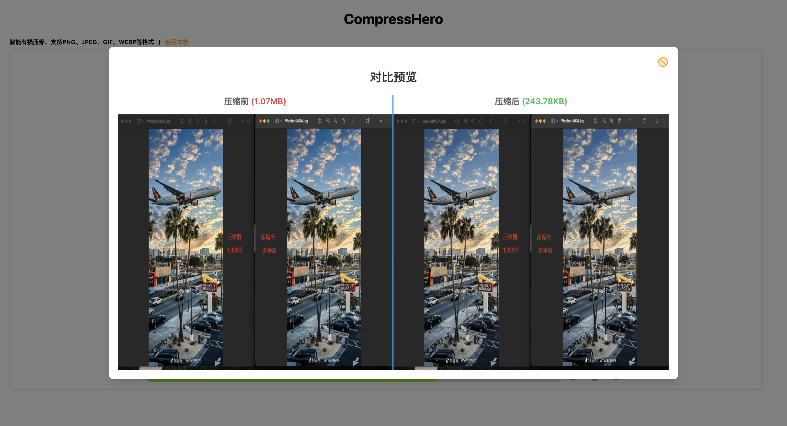
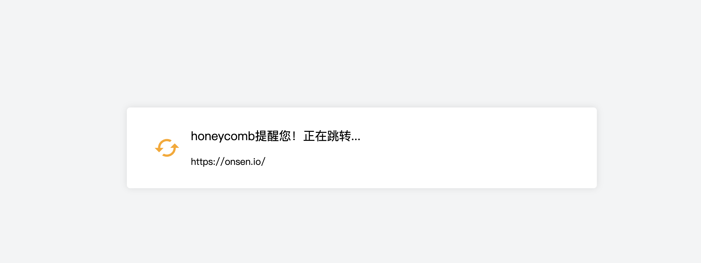
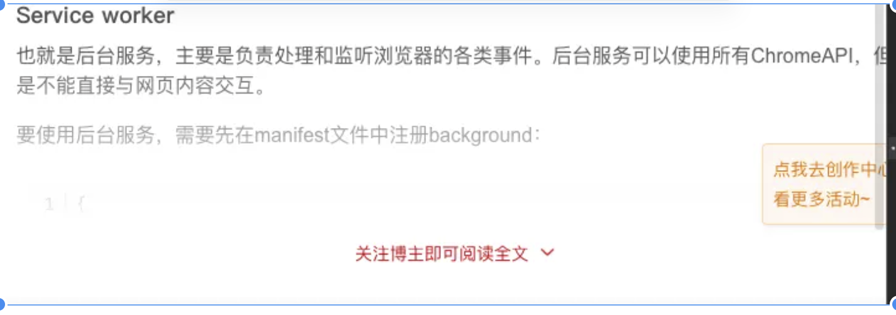

# Atom Honeycomb

#### 介绍

想象一下，有一个小工具能让你在浏览器里像蜜蜂一样快速穿梭于各种网页，找到你需要的信息。这就是`Atom Honeycomb`，一个基于[plasmo](https://plasmo.com)的浏览器扩展，它能让你以光速访问和搜索网页内容，支持任何通过URL中GET参数搜索的网站。

#### 为什么叫 Atom Honeycomb

选择这个名字是因为蜂巢不仅结构精巧，而且效率极高。就像我们的`Atom Honeycomb`扩展一样，简洁、高效，而且蜜蜂是勤劳的象征，正如我们这些勤劳的开发者一样，不停地在信息的花海中采集知识的花蜜

##### 安装1

1. 🛍️ [点击这里](https://chromewebstore.google.com/search/Atom%20Honeycomb?hl=zh-CN&utm_source=ext_sidebar) 直达扩展商店。
2. 🔨 点击`Add to Chrome`按钮，让`Atom Honeycomb`成为你的新伙伴。

##### 安装2

1. 🔍 [打开这里](https://github.com/LinHanlove/atomHoneycomb)，找到`Atom Honeycomb`的家。
2. 📎 点击`Code`按钮，然后选择`Download ZIP`。
3. 📂 解压文件，用vscode打开，运行`pnpm install`安装依赖，再运行`pnpm build`构建项目。
4. 🛠️ 打开`更多工具` -> `扩展程序`。
5. 🎛️ 打开`开发者模式`。
6. 📚 点击`加载已解压的扩展程序`，选择`Atom Honeycomb` --> `build` --> `chrome-mv3-prod`文件夹。

### 功能/亮点清单

| 功能/亮点                      | 描述                                                       |
| ------------------------------ | ---------------------------------------------------------- |
| 快捷搜索                       | 在搜索框中输入关键字，选择搜索目标，点击`搜索`按钮或回车。 |
| 区域截图                       | 快速截取网页区域，截图内容自动填充到剪切板。               |
| json数据美化                   | 将 JSON 数据漂亮地打印到 HTML 中以进行缩进和着色。         |
| 图片压缩                       | 智能有损压缩，支持PNG、JPEG、GIF、WEBP等格式               |
| githubDev                      | 一键打开GitHub页面，在VSCode中查看源码。                   |
| 刷新                           | 强制刷新当前页面，清除本地存储，确保最新内容。             |
| 添加/删除预设                  | 添加/删除你常用的搜索网站，一键直达。                      |
| 掘金，csdn等网站解除外链限制   | 解除网站外链访问限制，自由访问相关内容。                   |
| 右键操作菜单                   | 将功能集成到右键菜单，方便快速操作。                       |
| scdn自动展开内容不需要点击关注 | 自动展开内容，无需点击关注即可查看。                       |
| 点亮徽标                       | 快速打开插件、截图、刷新页面。                             |

### 右键操作菜单

| 功能/亮点     | 描述                                               |
| ------------- | -------------------------------------------------- |
| open          | 快速打开插件，开始你的搜索之旅。                   |
| search        | 快捷搜索                                           |
| refresh       | 强制刷新当前页面，清除本地存储，确保最新内容。     |
| githubDev     | 一键打开GitHub页面，查看源码，优化你的代码审查流程 |
| jsonFormatter | json数据美化                                       |
| compressHero  | 智能有损压缩                                       |

### 快捷键

| 功能/亮点                                                      | 描述                                               |
| -------------------------------------------------------------- | -------------------------------------------------- |
| 🚀 Alt + J                                                     | 快速打开json数据美化。                             |
|  Alt + A        | 快速截取网页区域，截图内容自动填充到剪切板。       |
| Alt + C | 强制刷新当前页面，清除本地存储，确保最新内容。     |
|  Alt + G   | 一键打开GitHub页面，查看源码，优化你的代码审查流程 |

#### 导入预设

- 🖹 点击`设置预设`按钮，弹出预设窗口。
- 📥 点击`一键导入预设`按钮，里面预设了一些常用的搜索网站，让你的搜索更快捷。

#### 添加预设

- 🖹 点击`设置预设`按钮，弹出预设窗口。
- 📝 点击`添加预设`按钮，在弹出的窗口中填写`名称`、`url前缀`和`url后缀`，定制你的搜索体验。
  

#### 删除预设

- 🖹 点击`删除预设`按钮，弹出删除预设窗口。
- 🗑️ 点击按钮，删除你不再需要的搜索网站。
  

#### 搜索

- 🔍 在搜索框中输入关键字，点击`搜索`按钮或回车，浏览器就会打开搜索结果页面。
  

#### 区域截图

- 📷 点击`区域截图`按钮，浏览器中打开截图工具，截图完成后，点击`✅`按钮，截图内容会自动填充到剪切板。
  

#### github 一键打开网页vscode查看源码

- 📦 点击`githubDev`按钮，浏览器会自动打开`vscode`，并打开对应的`github`仓库，让你更方便地查看源码。

#### json数据美化

- 📦 点击`jsonFormatter`按钮，浏览器会自动打开`jsonFormatter`，输入框输入对应的`json`数据，让你更方便地查看数据。
  

#### 智能有损压缩

- 📦 点击`compressHero`按钮，浏览器会自动打开`compressHero`，点击或拖动对应的`图片`数据，让你更方便地压缩图片。
  

##### 预览弹窗

##### 压缩后对比

#### 解除外链限制

- 打开预设的网站，右上角徽标点亮，会自动解除外链限制，让你自由访问相关内容。
  

##### 预设网站 【csdn ，掘金 ，知乎 ，简书，开源中国，码云】

- [CSDN](https://www.csdn.net/)
- [掘金](https://juejin.cn/)
- [知乎](https://www.zhihu.com/)
- [简书](https://www.jianshu.com/)
- [开源中国](https://www.oschina.net/)
- [码云](https://gitee.com/)

#### 无需恶心的关注

- 📦 打开预设的网站，右上角徽标点亮，会自动展开内容，无需点击关注即可查看。
  

#### 右键操作菜单

#### 强制刷新当前页面

- 🔄 点击`刷新`按钮，浏览器会清除当前网页本地『localStorage、sessionStorage、cookie』，强制刷新当前页面，让你看到最新的页面内容。

#### 注意

- 📚 本项目仅用于学习交流，别用它做坏事哦。
- 🔍 本项目不提供搜索结果，只提供搜索链接。
- 🌐 搜索结果来自互联网，我们不保证搜索结果的准确性。

#### 贡献

- 👨‍💻 欢迎提交`issue`、`pull request`、`star`、`fork`，让`Atom Honeycomb`变得更好。
- 💡 有新点子？提交`issue`，让我们一起讨论。

#### 联系

- 📧 邮箱：2188817393@qq.com
- 🌐 github：[LinHan](https://github.com/LinHanlove)
  有问题？有想法？来找我聊聊吧！

---

👆 以上就是`Atom Honeycomb`的介绍，希望你喜欢这个小而美的项目！如果你有任何问题或者想要了解更多，随时欢迎联系我。让我们一起把`Atom Honeycomb`做得更好！🌟
